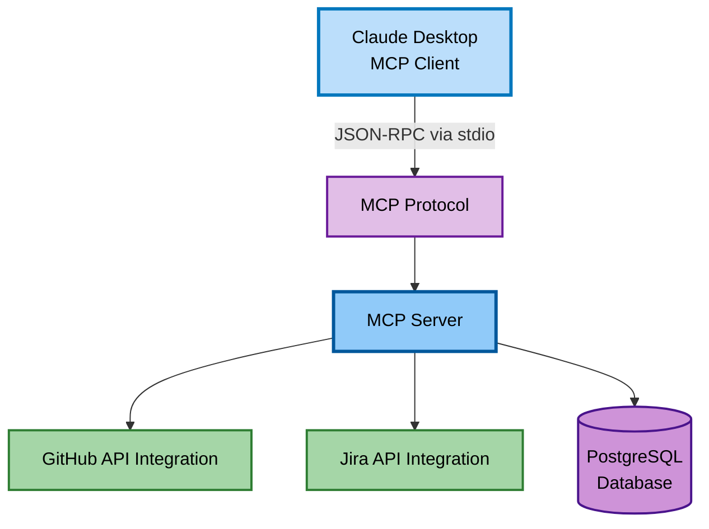

# Developer Skill Analyzer - Architecture Flowchart

## Architecture Layers

### 1. Client Layer
- **Claude Desktop**: MCP client hvor dataanalytiker interagerer med systemet

### 2. Protocol Layer
- **MCP Protocol**: JSON-RPC communication via stdio mellem client og server

### 3. Server Layer (FastMCP)
- **Config Layer**: Environment variable management (GitHub tokens, Jira credentials)
- **Service Layer**: Raw data fetching fra eksterne APIs
- **Analyzer Layer**: Business logic for skill level calculation
- **Sanitizer Layer**: GDPR-compliant data cleaning

### 4. External APIs
- **GitHub API**: Repository data, language statistics
- **Jira API**: Issues, projects, user activity

### 5. Persistence Layer
- **PostgreSQL Database**: Structured storage af developer competences
- **JSON Export**: File-based export til eksterne analyseværktøjer

## Data Flow

1. **Request**: Dataanalytiker kalder MCP tool via Claude Desktop
2. **Authentication**: Config layer loader credentials fra environment variables
3. **Fetch**: Service layer henter raw data fra GitHub/Jira APIs
4. **Analysis**: Analyzer layer beregner skill levels og kategoriserer kompetencer
5. **Sanitization**: Data sanitizer fjerner PII (emails, phone numbers)
6. **Persistence**: Data gemmes i database eller eksporteres til JSON
7. **Response**: Results returneres til Claude Desktop for visning
