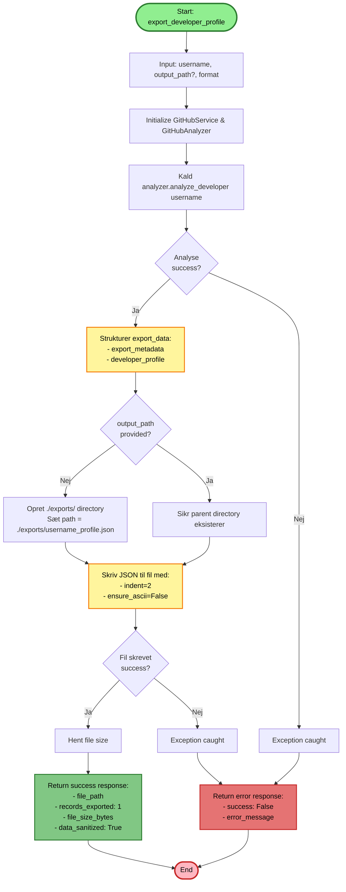

# Export Developer Profile - Flowchart

Dette flowchart viser processen for `export_developer_profile` funktionen.

## Nøglepunkter

1. **Input validering**: Modtager username (påkrævet) og optional output_path
2. **Analyse-fase**: Henter kompetencedata via GitHub analyzer
3. **Datastrukturering**: Bygger export_data med metadata og saniteret profil
4. **Path håndtering**: Auto-genererer standard path eller bruger custom path
5. **Fil-skrivning**: Gemmer JSON med formatting (indent + UTF-8)
6. **Response**: Returnerer success med file metadata eller error ved fejl

## Visualisering

Åbn denne fil i VS Code og tryk `Ctrl+Shift+V` for at se flowchartet i preview mode.
