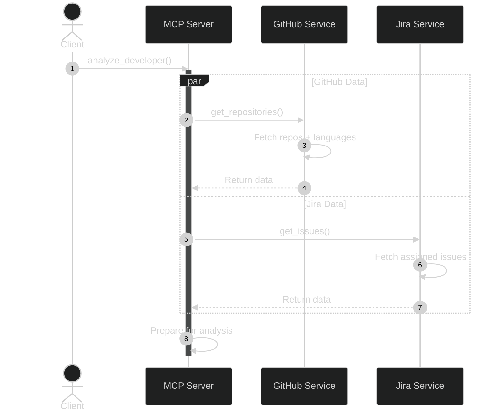
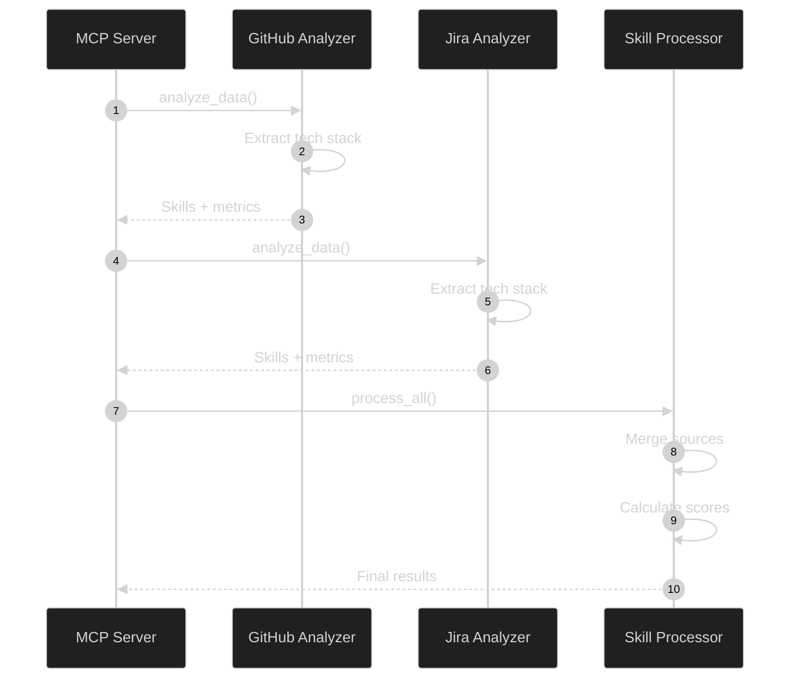
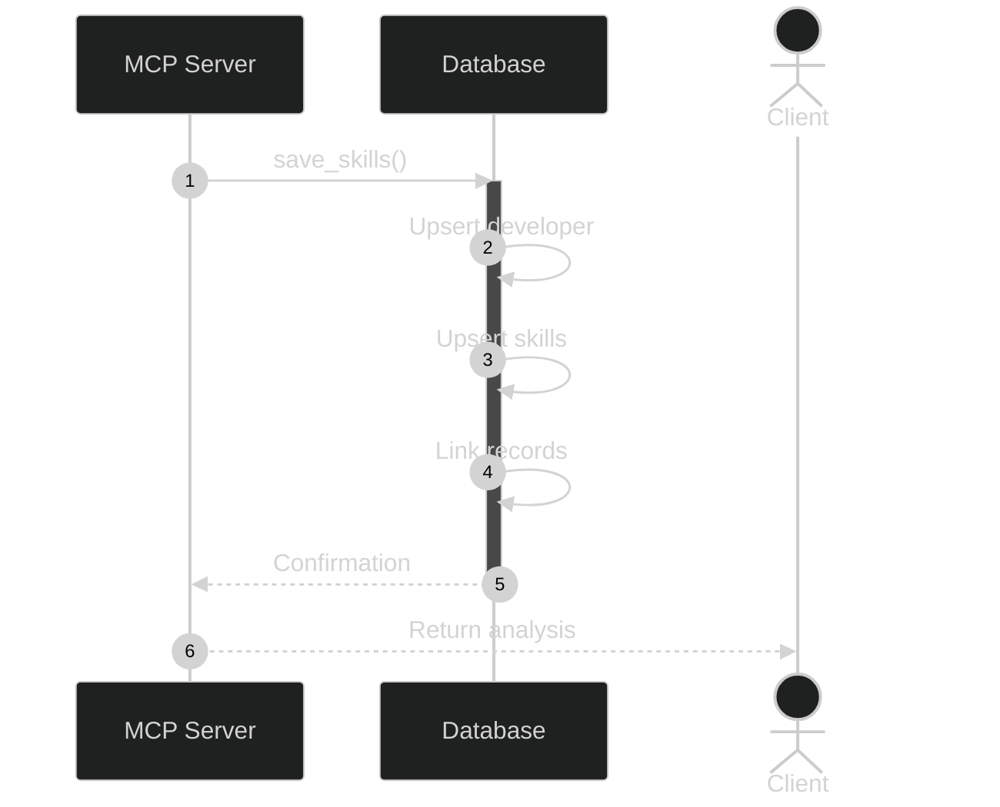
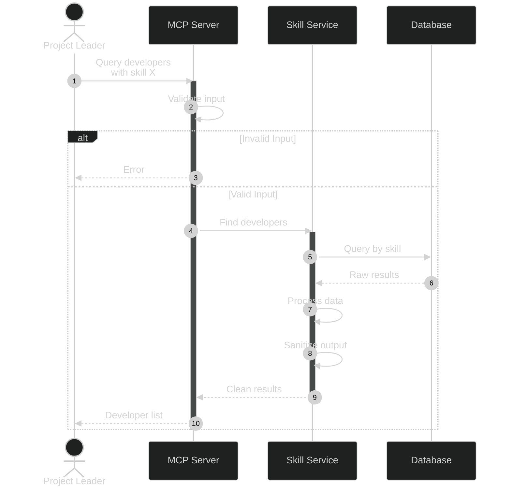
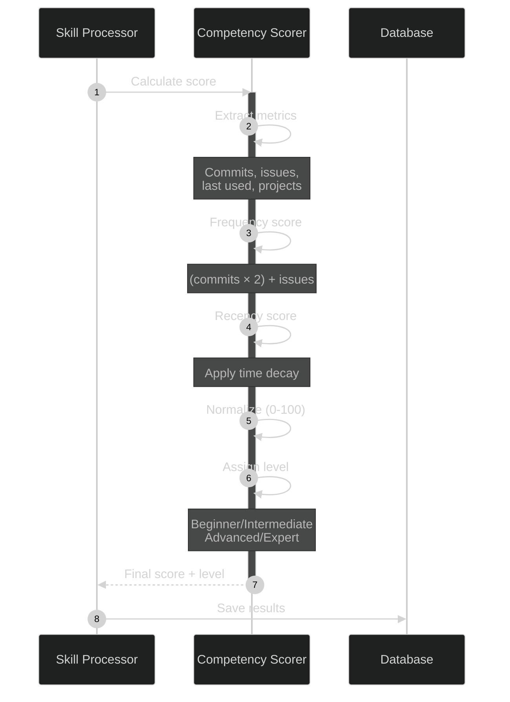

# Sequence Diagrams - Developer Skill Analysis MCP Server

This document contains sequence diagrams for the core user stories of the MCP server.

---

## User Story 7: Data Analysis Flow (Priority 4)
**As an MCP server**, I want to analyze incoming data from Jira and GitHub to extract technologies and their usage frequency, so that a competency score can be created for each developer.

### Sequence Diagram - Part 1: Data Fetching



### Sequence Diagram - Part 2: Analysis & Scoring



### Sequence Diagram - Part 3: Data Persistence



### Key Components

1. **Parallel Data Fetching**: GitHub and Jira data are fetched simultaneously for efficiency
2. **Analyzers**: Separate analyzers process each data source independently
3. **Skill Processor**: Merges and normalizes data from both sources
4. **Competency Scoring**: Calculates proficiency based on activity frequency and recency
5. **Database Persistence**: Stores structured skill data with relationships

---

## User Story 12: Query Developer Skills (Priority 5)
**As a project leader**, I want to query the MCP server to get a list of developers with specific competencies, so that I can use the data in other systems.

### Sequence Diagram



### Key Components

1. **Input Validation**: Ensures skill names and proficiency levels are valid
2. **Filtered Query**: Database queries with skill and proficiency filters
3. **Data Aggregation**: Combines skill data from multiple sources
4. **Sanitization**: Removes sensitive information before export
5. **Structured Response**: Returns standardized JSON format

### Response Format Example

```json
{
  "skill": "Python",
  "min_level": "intermediate",
  "developers": [
    {
      "username": "john_doe",
      "skills": [
        {
          "name": "Python",
          "proficiency": "advanced",
          "competency_score": 85,
          "last_used": "2025-12-15"
        }
      ],
      "total_commits": 342,
      "total_issues": 28
    }
  ],
  "total_count": 5
}
```

---

## User Story 9: Calculate Competency Level (Priority 3)
**As an MCP server**, I want to calculate a competency level for each technology based on activity volume, so that competencies can be compared between developers.

### Sequence Diagram


**Recency Factor:**
- Last 3 months: 1.0
- 3-6 months: 0.9
- 6-12 months: 0.7
- 12-24 months: 0.4
- 24+ months: 0.2

**Proficiency Levels:**
- **Beginner** (0-30): Limited experience
- **Intermediate** (31-60): Regular use
- **Advanced** (61-85): Extensive experience
- **Expert** (86-100): Deep expertise

---

## Recommended VS Code Extensions

### Essential
1. **Mermaid Chart** (`bierner.markdown-mermaid`)
   - Official Mermaid preview in Markdown files
   - Live preview with auto-refresh
   - Export diagrams as SVG/PNG

2. **Markdown Preview Mermaid Support** (`bierner.markdown-mermaid`)
   - Integrates with VS Code's built-in Markdown preview
   - No additional setup required

### Enhanced Visualization
3. **Draw.io Integration** (`hediet.vscode-drawio`)
   - Advanced diagram editing
   - Export to multiple formats
   - Interactive editing

4. **PlantUML** (`jebbs.plantuml`)
   - Alternative diagram syntax
   - More detailed sequence diagrams
   - Professional styling options

### Installation Command
```bash
code --install-extension bierner.markdown-mermaid
code --install-extension hediet.vscode-drawio
```

---

## Viewing These Diagrams

1. **In VS Code**: Open this file and press `Ctrl+Shift+V` (Windows) or `Cmd+Shift+V` (Mac) for preview
2. **In GitHub**: Diagrams render automatically in Markdown files
3. **Export**: Use Mermaid Live Editor (mermaid.live) for high-quality exports

---

## Notes

- These diagrams represent the **happy path** flow
- Error handling and edge cases are simplified for clarity
- Actual implementation may include additional validation and retry logic
- Database transactions and connection pooling are abstracted
